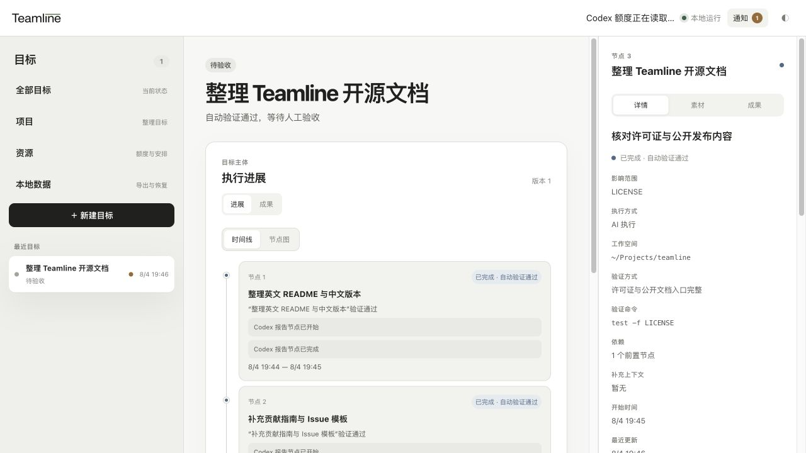
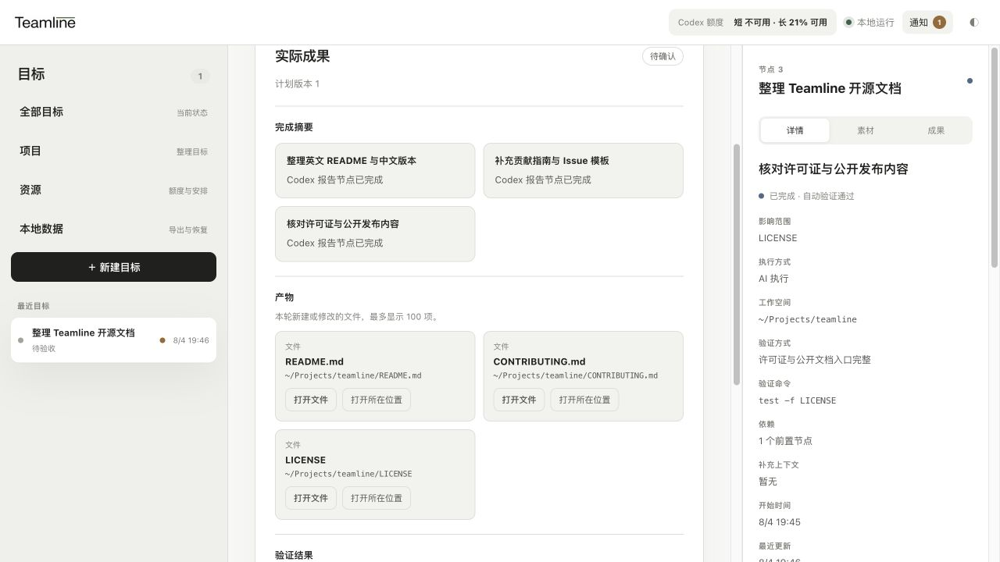
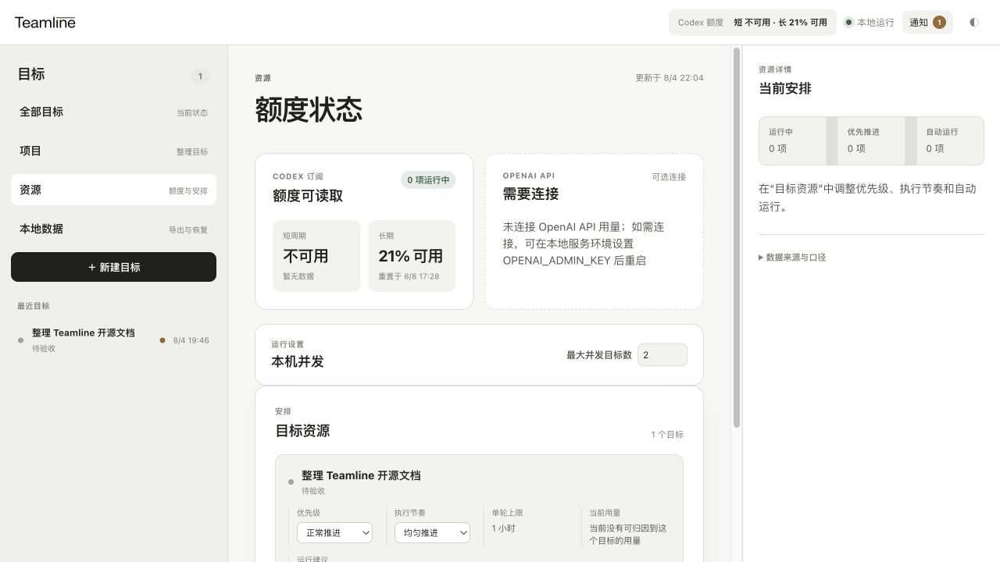

# Teamline

<p align="center">
  
</p>

<p align="center">一个把 AI 工作整理成清晰、可推进、可验收目标的本地控制台。</p>

<p align="center">
  <a href="README.md">English</a> ·
  v2.1 ·
  Early access · Apple Silicon macOS
</p>

Teamline 为聊天窗口之外的 AI 工作提供一个稳定入口。它把目标整理成计划，将每个 AI 节点作为一次独立的 Codex 执行，持续展示当前状态，并在最后集中呈现成果供用户验收。

Teamline 的控制服务和界面运行在 Mac 本机，不需要注册账号。目标、计划、执行记录和引用保存在 Teamline 的本地数据目录中，用户上传的素材也会复制到该目录。Teamline 在整理导入会话、生成计划或执行目标时，本地 Codex 可能会按照用户的 Codex 配置和数据设置，把必要的会话、目标、素材或工作区内容发送给 OpenAI。



## Teamline 能做什么

- 创建编码、产品设计、文档协作、调研等具有明确结果的目标。
- 在执行前生成可以编辑和确认的计划。
- 将一个或多个本地 Codex 会话导入为一个目标，再从新会话继续推进。
- 按顺序逐个运行 AI 节点，每个节点都有独立的 Codex 执行、结果和验证。
- 通过时间线或节点图展示进展，默认不把完整工具调用和原始日志铺在主界面。
- 集中展示生成文件、完成摘要和验证结果，方便最终验收。
- 展示 Codex 可用性，并为每个目标设置优先级、执行节奏和单轮时限。
- 分别管理 Codex 账号和可读取的额度窗口，并把运行中的目标绑定到实际账号。
- 在实际用量可读取时，可为单个目标开启付费 API 接力，并同时受全局和目标限额约束。
- 使用轻量项目整理目标，并为项目保存引用或上传的素材。

## 使用流程

1. 新建目标，或者导入已有 Codex 会话。
2. 生成、编辑并确认计划。
3. 选择 Git 仓库或普通文件夹并开始执行。
4. 查看各节点进展，在需要时响应，最后验收整体成果。

同一目标内的节点按顺序串行执行。不同目标可以在本机并发上限内并行运行。

## 产品界面

### 验收实际成果

成果页把完成摘要、变化文件和验证结果放在一起，在确认完成前可以直接检查。



### 管理本地 AI 资源

资源页展示当前可读取的 Codex 状态，以及每个目标的运行偏好。只有在用量与费用能够可靠读取并归因时，Teamline 才会展示对应数据。



## 当前状态

Teamline 目前处于 Early access，当前产品版本为 `v2.1`。

当前支持：

- Apple Silicon macOS
- [Bun](https://bun.sh/)
- 已在本机安装并登录的 Codex CLI
- 本地网页和 CLI
- 从源码运行的 Electron 桌面壳

目前还没有正式安装包，也暂不支持 Windows、Linux、云端账号以及 Codex 之外工具的完整执行能力。

本票只交付从源码运行的 Electron 桌面壳；正式打包与分发另行处理。

## 从源码运行

```bash
git clone https://github.com/mekoand/teamline.git
cd teamline
bun run dev
```

然后打开 <http://127.0.0.1:4310>。

本地网页和 Electron 桌面壳连接同一个 `http://127.0.0.1:4310` Local Core，本地网页不会自动打开浏览器。Teamline 默认将 Local Core 数据保存在 `.teamline/`。如需使用其他位置，可以设置 `TEAMLINE_DATA_DIR`。

从源码启动桌面壳前先安装依赖，然后运行：

```bash
bun install
bun run desktop
```

关闭 Electron 窗口只会隐藏客户端，不会停止由 Local Core 持有的目标执行；重新打开窗口后会连接到同一份本地数据。

付费 API 接力是默认关闭的可选功能。需要设置项目级 `OPENAI_API_KEY`、`OPENAI_ADMIN_KEY` 和对应的 `OPENAI_PROJECT_ID`，并为 Teamline 使用独立项目。付费节点会串行执行，项目实际费用的增量会归入当时运行的目标。Teamline 不保存 Key。资源页还必须设置全局月度预算，目标也必须单独设置付费限额。由于供应商费用可能延迟回传，Teamline 会在观察到限额后停止后续节点，但不承诺绝不超支；实际用量无法归因到目标时，也不会使用估算值继续运行。确认是零费用或跨月边界时，可以在资源页手动解除等待。

运行测试：

```bash
bun test
```

## 命令行入口

保持本地服务运行后，可以在目标相关目录中使用 CLI：

```bash
bun run cli -- create "修复登录页偶发的空白" --acceptance "相关测试通过"
bun run cli -- list
bun run cli -- show <目标 ID 或唯一前缀>
bun run cli -- interrupt <目标 ID 或唯一前缀>
bun run cli -- continue <目标 ID 或唯一前缀>
bun run cli -- open <目标 ID 或唯一前缀>
```

计划、执行图、成果验收和资源设置仍在网页中完成。

## 后续方向

- 更方便的安装与更新
- 接入更多 AI 工具
- 团队协作

这些是产品方向，不代表已经承诺的版本或日期。

## 文档

- [领域词汇表](CONTEXT.zh-CN.md)
- [个人版 V2 规格](docs/specs/personal-v2.zh-CN.md)
- [个人版 v0 规格](docs/specs/personal-v0.zh-CN.md)
- [架构决策记录](docs/adr/)
- [产品假设](PRODUCT-HYPOTHESIS.zh-CN.md)

领域词汇表、产品规格和产品假设以英文作为规范版本，并提供完整的中文对应版本；ADR 保持现有英文优先、附原始中文的结构。

## 参与贡献

Bug 和功能建议可以使用英文或中文提交。提交 Issue 或 Pull Request 前，请先阅读 [CONTRIBUTING.md](CONTRIBUTING.md)。

## 许可证

Teamline 使用 [Apache License 2.0](LICENSE)。
